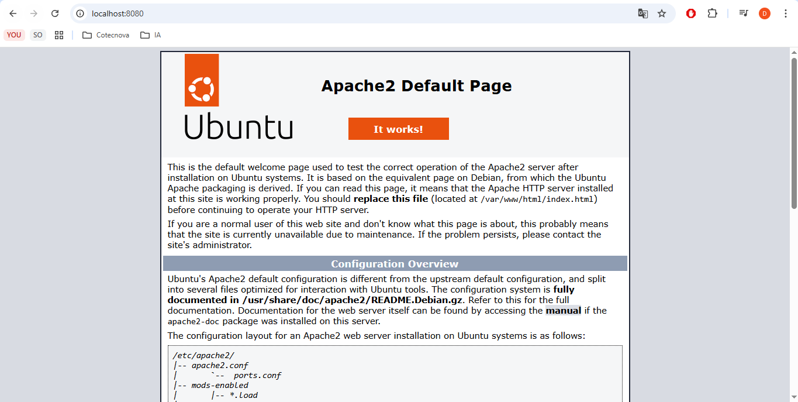
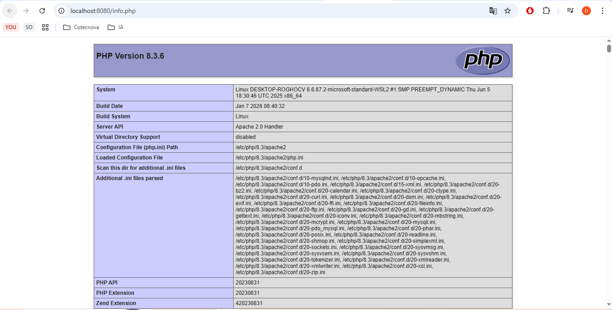
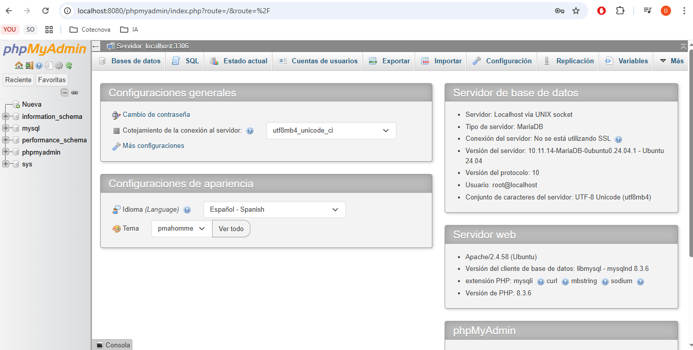

Actividad Independiente

1- ¿Que es Apache?
R/ Apache es un software de servidor web de codigo abierto que gestiona la entrega 
de contenido web desde un servidor a los navegadores de los usuarios mediante el
protocolo HTTP

2- ¿Qué es LAMP?
R/ Es una pila de soluciones de software de codigo abierto usada para desarrollar
e implementar aplicaciones web. Esta compuesta por: 
L: Linux
A: Apache
M: Mysql
P: Php

3- Direfencia entre Apache vs NGINX
Apache se basa en procesos lo cual lo hace mas facil de configura y compatible con 
configuraciones por directorio, ideal para sitios dinamicos y alojamiento
compartido. Sin embargo, consume mas recursos bajo cargas altas.
NGINX se basa en eventos tiene mayor rendimiento y consume menos recuros lo cual
lo hace ideal para el alto trafico y contenido estatico.

4- Capturas:
	

